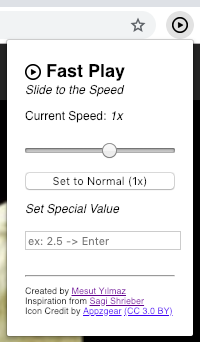

# fastPlay
Fastplay is a Chrome extension which changes video speed

fastPlay supports lots of video storage and streaming services like Youtube, Netflix, Vimeo and others.

## How to use?

Open extension on a video web site.

1.  Change speed by sliding
2. Setting special value by entering numerical value or up & down arrows.

